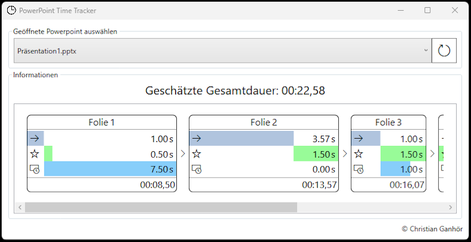

# PowerPoint Time Tracker
This application allows tracking how long the slide show of an open PowerPoint presentation will approximately take. While manually measuring the time or exporting the presentation as `.mp4` is more accurate, this application allows to get a quick estimate. 

Here is how the app looks like:  

Please note that for now, it is only available in German.